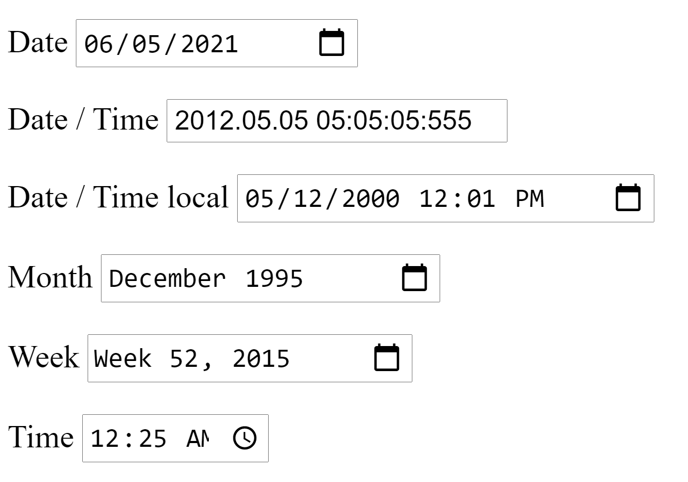

## 009 Feladat: selenium dátum mezők gyakorlása

A feladatokat külön python fileban oldd meg. Minden feladat tartalmazza az elvárt filenevet. Ezen a néven fogadható el a megoldás.

1) Készíts egy Python alkalmazást ami selenium-ot használ. Indítsd el lokálisan a selenium-py-peldatar alkalmazást. A program töltse be a példatárból az `http://localhost:9999/forms.html` oldalt. Koncentrálj a dátum mezőkre. A célod, hogy ezeket a dátum és idő értékekete selenium segítségével automatikusan beáléítsd:

    > A megoldást egy `setdates.py` nevű fileban kell beadnod.

## Feladat beadása
A fent eméített python file-okat és benne a megoldásodat kérlek a saját `selenium-py-peldatar` github repo forkodban egy `selenium2-homework` nevű mappába helyezd el.
